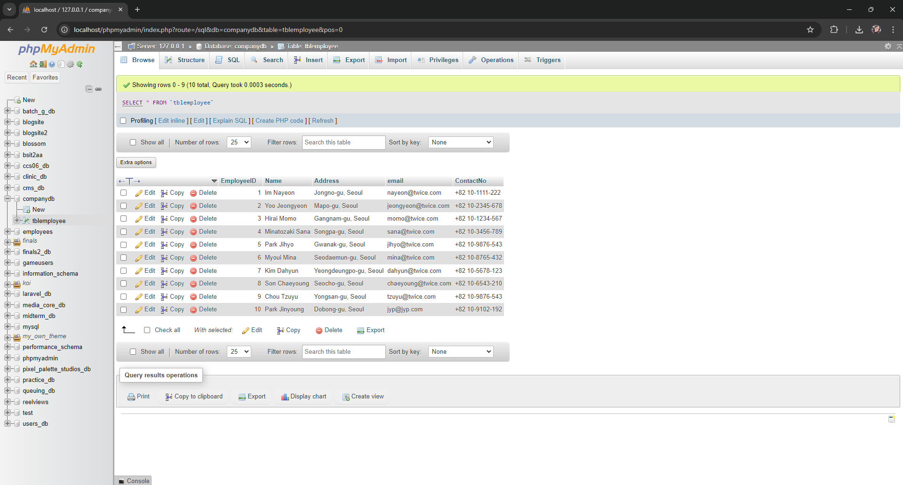
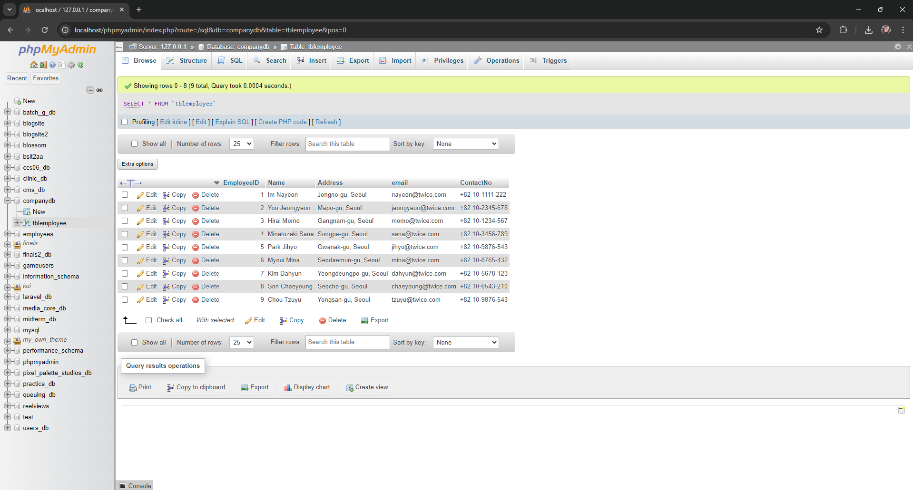

# Module05 - Exercise01 (PDC50-LAB)

    Name of Student: Elmalia Jane S. Diaz
    Year and Section: BSIT4A
    Activity Title: Module05-Exercise02
    Date Submitted: October 30, 2024

## Enhancing the Employee Contact Management Application
### Source Code
- [EmployeeViewModel.cs](Module05Exercise01/ViewModel/EmployeeViewModel.cs)
- [ViewEmployees.xaml](Module05Exercise01/View/ViewEmployees.xaml)
- [ViewEmployees.xaml.cs](Module05Exercise01/View/ViewEmployees.xaml.cs)
- [EmployeeService.cs](Module05Exercise01/Services/EmployeeService.cs)

## Adding a new employee
### Output Screenshots

    
    
    

    

## Deleting an Employee
### Output Screenshots

    
    
    

    

